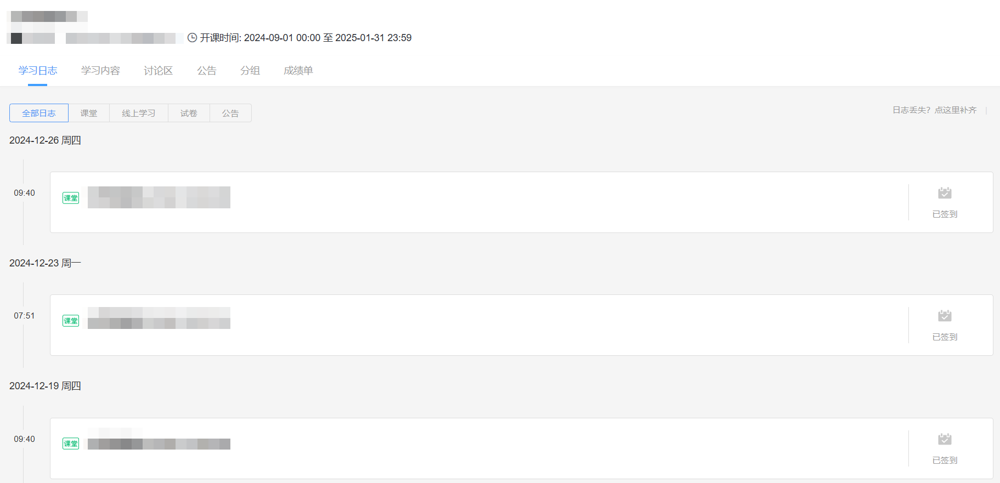

# proyuketang-afterclassCrawler

在荷塘雨课堂下载指定课堂的所有课件和视频回放。

**该项目仅供个人学习参考，下载内容严禁传播或营利，使用完毕请及时删除。请自觉遵守相关法律法规，一切法律责任由用户自行承担。**

## 使用说明

### 1. 配置 `config.json` 文件

登录[荷塘雨课堂](https://pro.yuketang.cn/)，进入某门课程如下图所示，点击进入任一需要下载的课堂。



将课堂页面网址中的 “课堂 ID” 复制到 `config.json` 文件的 `lesson_id` 项中，这通常是一个 19 位数字，如下面网址中的 `131986699xxxxxxxxxx`：

```
https://pro.yuketang.cn/v2/web/student-lesson-report/313xxxx/131986699xxxxxxxxxx/808xxxx
```

`sessionid` 项可留空，运行程序时扫码登录后会自动获取、保存。

### 2. 运行程序

确保安装所有依赖后运行该程序，注意 `fpdf` 需要安装 `fpdf2`。

```
python afterclass_crawler.py --mode slides
```

参数说明：
- `--mode`：下载模式，可选值为 `slides`（默认）、`videos` 或 `both`。
  - `slides`：仅下载课件，保存至 `{lesson_title}/{num}_{presentation_title}.pdf`。
  - `videos`：仅下载视频回放，保存至 `{lesson_title}/{lesson_title}_{num}.mp4`。
  - `both`：同时下载课件和视频回放。

## LISENCE

本仓库的内容采用 [CC BY-NC-SA 4.0](https://creativecommons.org/licenses/by-nc-sa/4.0/) 许可协议。您可以自由使用、修改、分发和创作衍生作品，但只能用于非商业目的，署名原作者，并以相同的授权协议共享衍生作品。

如果您认为文档的部分内容侵犯了您的合法权益，请联系项目维护者，我们会尽快删除相关内容。
